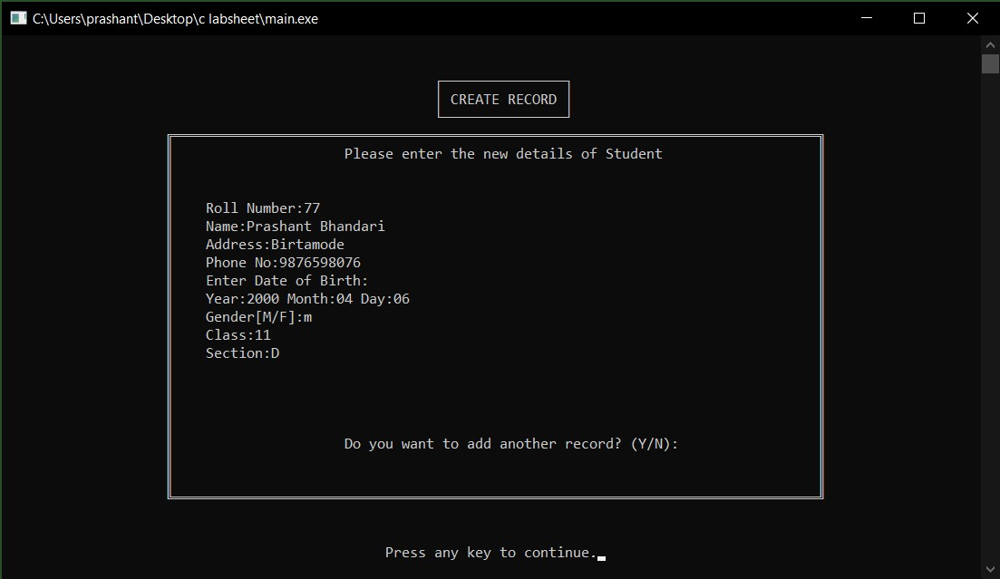

# Introduction

**Project Title: Student Record Management System**

**Core Language: C Language**

This program **Student Record Management System** is anapplication design for recording the students details such as Roll no, Name, Address, Phone No, Date of Birth, Gender, Class and Section and so on. The user can add records, view records, search records, modify records, delete records and exit program. This program is developed in such a way so that any School can easily use this with little changes per needed. It has been designed in a simple manner so that the user won’t find himself/herself any difficulty while using the program.

## Existing System Overview

From the early days the school record their students’ data in a written form for the present and future use. However, the main problem is that the data cannot be updated and or deleted systematically. It is also very difficult to search the particular student’s details quickly.

## Proposed System Overview

This system will help the school to keep the records in a systematic order. This program helps to record new student’s information, view the recorded data, search the information about particular student, and delete the student record.

## System Objective

* To store the record of the students.
* To provide the easy access of the data to the authorized user.
* To view, search, modify, delete the records of the students.

## System Features

* Only the authorized person can access the system.
* The information regarding the student can be kept.
* Report can be shown.

## System Limitations

* This system doesn’t provide online system.
* User cannot change username and password.
* Although language used in this program is simple and easily understandable, it is not so user friendly because it is **CLI** (Command Line Interface) based program and does not have modern **GUI**.

## System Advantages

* USER FRIENDLY: This program is easily readable and understandable to any user. They can easily handle this project. It takes very less time to the user to understand the program. The language used in this program is simple and easily understandable.
* MENU DRIVEN: This program is menu driven. The program can be used by using keyboard.
* SECURITY: This program provides the faculty of locking the system by using login username and password.
* HARDWARE: This program is simple and does not contain any graphical components so it needs low hardware resources to run.

# Function used in system

|    Function Name      |                   Description                 |
|-----------------------|-----------------------------------------------|
| ``clrscr()``          | Clears Console Screen.                        |
| ``gotoxy()``          | Places cursor at a desired location on screen.|
| ``box_single_line()`` | Draw rectangle with single line border.       |
| ``box_double_line()`` | Draw rectangle with double line border.       |
| ``login()``           | To check User Credentials.                    |
| ``print_menu()``      | Print Main Menu.                              |
| ``print_delmenu()``   | Print Delete Menu.                            |
| ``rcreate()``         | Create student record.                        |
| ``rdisplay()``        | Display all student records.                  |
| ``rsearch()``         | Search student record.                        |
| ``rmodify()``         | Modify student record.                        |
| ``rdelete()``         | Delete individual student record.             |
| ``ralldelete()``      | Delete all student records.                   |
| ``logout()``          | To Logout.                                    |

# Header Files used in system

|  Header Files  |                                                                                                                                 Description                                                                                                                                            |
|----------------|----------------------------------------------------------------------------------------------------------------------------------------------------------------------------------------------------------------------------------------------------------------------------------------|
| **stdio.h**    | For Standard input and output functions                                                                                                                                                                                                                                                |
| **conio.h**    | For other functions like ``getch()``.                                                                                                                                                                                                                                                  |
| **stdlib.h**   | For using standard library functions like ``system()``.                                                                                                                                                                                                                                |
| **string.h**   | For using string function like ``gets()``,`` puts()``, ``strcpy()``, ``strcmp()``etc.                                                                                                                                                                                                  |
| **windows.h**  | **windows.h** is a Windows-specific header file for the C and C++ programming languages which contains declarations for all of the functions in the Windows API, all the common macros usedby Windows programmers, and all the data types used by the various functions and subsystems.|

# Algorithm

```
Step 1: Start

Step 2: Ask to enter the Login credentials.

Step 3: Check username and password.
        If username and password matches, then go to Step 4
        else Display Invalid Password and go to Step 2.
      
Step 4: Main Menu.

Step 5: If choice is 1, go to Step 6,
        If choice is 2, go to Step 7,
        If choice is 3, go to Step 8,
        If choice is 4, go to Step 9,
        If choice is 5, go to Step 10,
        If choice is 6, go to Step 14,
        If choice is 7, go to Step 15,
        else display Invalid Input and goto Step 4.

Step 6: Create Student Record and goto Step 4.

Step 7: Display All Student Records and goto Step 4.

Step 8: Search Student Records and goto Step 4.

Step 9: Modify Student Records and goto Step 4.

Step 10: Delete Menu

Step 11: If choice is 1, go to Step 12,
         If choice is 2, go to Step 13,
         If choice is 3, go to Step 4,
         If choice is 4, go to Step 15,
         else display Invalid Input and goto Step 10.

Step 12: Delete Individual Record and goto Step 10.

Step 13: Delete All Records and goto Step 10.

Step 14: Log out and goto Step 2.

Step 15: Exit
```

# Implementation and Testing

## Desired Output

This program must keep the record of students with their details. It enables us to create record for the student in a systematic way. It helps us to create, edit, search and delete records. While creating, editing, searching and deleting the records, this program enables the user to return back to the main menu without exit from the program.

## Final Result
After implementing, testing, debugging and retesting the program numerous times, the program has now met the result we expected. This program provides a main menu from where we can do all task of the system. Main menu system allows a user to choose an option whether to add record, view record, search record, modify record,delete record, log out and exit program. This program has maintained the privacy using login, where only the authorized user can access the entire program. Finally, this program meets approximate all the expected objectives and goals of **Student Record Management System.**

# Screenshot

## **Login**

## **Main Menu**

## **Create Record**

## **View Record**

## **Search Record**

## **Modify Record**

## **Delete Menu**

## **Delete Record**

